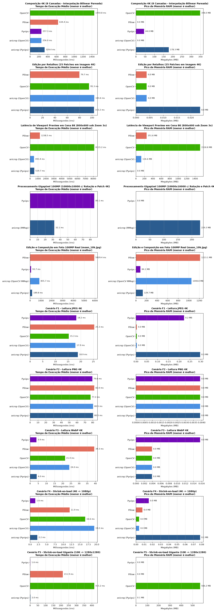

# Avaliação de Desempenho do anicrop em Pipelines de Renderização 2D

> **Data de Execução:** 2026-08-31 04:46:43
> **Ambiente:** Python 3.12+, uv virtualenv, Linux
> **Bibliotecas Analisadas:** `anicrop`, `Pillow`, `OpenCV` (NumPy), `Pyvips`

## 📊 Sumário Executivo por Cenário

### Composição 4K (8 Camadas - Interpolação Bilinear Pareada)

| Biblioteca           | Tempo Médio   | Throughput (FPS)   | Min        | Max        | Pico RAM   |
|----------------------|---------------|--------------------|------------|------------|------------|
| **anicrop (Pyvips)** | 302.93 ms     | 3.30 FPS           | 297.76 ms  | 311.43 ms  | 137.85 MB  |
| **anicrop (OpenCV)** | 272.26 ms     | 3.67 FPS           | 250.92 ms  | 341.96 ms  | 0.01 MB    |
| **Pyvips**           | 281.92 ms     | 3.55 FPS           | 273.85 ms  | 292.94 ms  | 63.44 MB   |
| **Pillow**           | 708.15 ms     | 1.41 FPS           | 688.06 ms  | 764.16 ms  | 0.00 MB    |
| **OpenCV**           | 1488.64 ms    | 0.67 FPS           | 1482.00 ms | 1495.90 ms | 347.94 MB  |

### Edição por Retalhos (25 Patches em Imagem 4K)

| Biblioteca           | Tempo Médio   | Throughput (FPS)   | Min       | Max       | Pico RAM   |
|----------------------|---------------|--------------------|-----------|-----------|------------|
| **anicrop (Pyvips)** | 116.02 ms     | 8.62 FPS           | 110.36 ms | 137.46 ms | 59.73 MB   |
| **anicrop (OpenCV)** | 134.87 ms     | 7.41 FPS           | 105.42 ms | 214.06 ms | 0.00 MB    |
| **OpenCV**           | 97.75 ms      | 10.23 FPS          | 96.65 ms  | 100.41 ms | 0.00 MB    |
| **Pillow**           | 82.30 ms      | 12.15 FPS          | 79.89 ms  | 86.87 ms  | 0.00 MB    |

### Latência de Viewport Preview em Cena 8K (800x600 sob Zoom 3x)

| Biblioteca           | Tempo Médio   | Throughput (FPS)   | Min        | Max        | Pico RAM   |
|----------------------|---------------|--------------------|------------|------------|------------|
| **anicrop (Pyvips)** | 508.33 ms     | 1.97 FPS           | 506.41 ms  | 509.74 ms  | 126.57 MB  |
| **anicrop (OpenCV)** | 571.93 ms     | 1.75 FPS           | 569.34 ms  | 573.60 ms  | 252.43 MB  |
| **OpenCV**           | 9616.56 ms    | 0.10 FPS           | 9597.29 ms | 9627.36 ms | 1645.34 MB |
| **Pillow**           | 1281.32 ms    | 0.78 FPS           | 1275.44 ms | 1285.19 ms | 315.58 MB  |

### Processamento Gigapixel 100MP (10000x10000 c/ Rotação e Patch 4K)

| Biblioteca         | Tempo Médio   | Throughput (FPS)   | Min      | Max      | Pico RAM   |
|--------------------|---------------|--------------------|----------|----------|------------|
| **anicrop (Zarr)** | 81.70 ms      | 12.24 FPS          | 80.80 ms | 82.53 ms | 75.77 MB   |
| **Pyvips**         | 84.76 ms      | 11.80 FPS          | 83.50 ms | 86.99 ms | 0.02 MB    |

### Edição e Composição em Foto 100MP Real (moon_10k.jpg)

| Biblioteca                | Tempo Médio   | Throughput (FPS)   | Min        | Max        | Pico RAM   |
|---------------------------|---------------|--------------------|------------|------------|------------|
| **anicrop (Pyvips)**      | 224.06 ms     | 4.46 FPS           | 216.76 ms  | 238.30 ms  | 129.63 MB  |
| **anicrop (OpenCV Zarr)** | 1515.40 ms    | 0.66 FPS           | 1496.84 ms | 1544.98 ms | 763.31 MB  |
| **Pyvips**                | 100.24 ms     | 9.98 FPS           | 97.28 ms   | 105.34 ms  | 84.08 MB   |
| **Pillow**                | 6263.18 ms    | 0.16 FPS           | 6241.49 ms | 6281.35 ms | 1173.94 MB |

## 📈 Gráficos Comparativos

